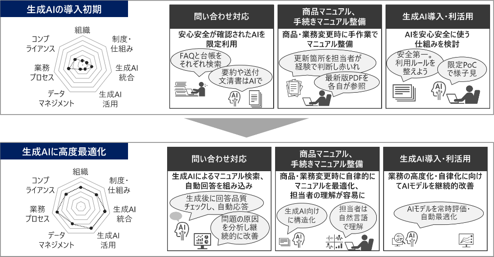
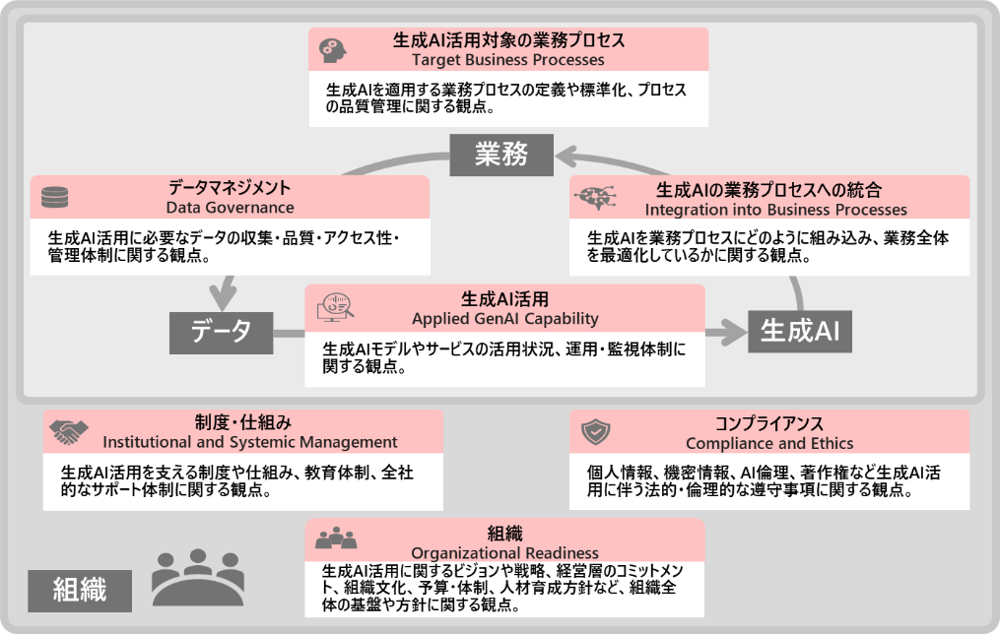
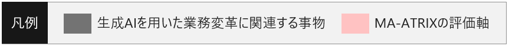
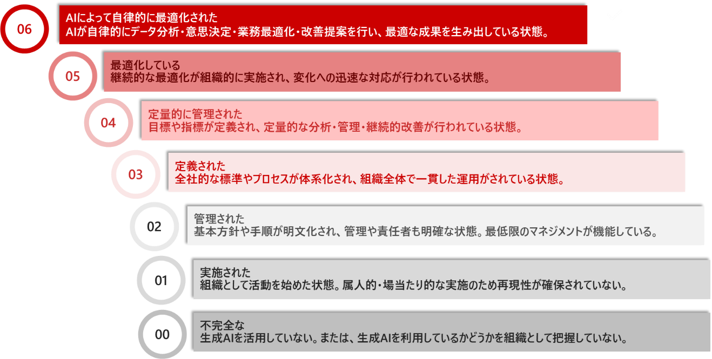

- 「MA-ATRIX」本文のダウンロードは[こちら](https://github.com/ma-atrix/ma-atrix/raw/main/docs/ma-atrix.pdf)

***

2025年10月22日 株式会社日立製作所 Gen-AX株式会社

 　　

### 日立とGen-AX、業務変革を加速する生成AI活用の成熟度モデル「MA-ATRIX」を無償公開

#### 7つの評価軸でお客さまの現状診断と生成AI導入・活用の段階的ロードマップ策定を支援
 

　株式会社日立製作所(以下、日立)とGen-AX株式会社(ジェナックス、以下、Gen-AX)は、組織の生成AI活用状況を7つの評価軸で体系的に診断し、業務変革の段階的な推進とガバナンス強化を支援する成熟度モデル「MA-ATRIX[^1](Maturity Assessment & AI TRansformation IndeX；Generative AI Adaptation Roadmap)」を共同開発し、[本日無償公開](https://github.com/ma-atrix/ma-atrix/raw/main/docs/ma-atrix.pdf)しました。「MA-ATRIX」は、日立がこれまでに創出した1,000件を超える生成AI活用のユースケースと、Gen-AXが提供してきた、生成AIを活用したSaaS[^2]やコンサルティングサービスで培ったノウハウに基づいて開発しました。従来のモデルがAI全般の導入度評価に重点を置いていたのに対し、「MA-ATRIX」は、従来では把握しきれなかった生成AIによる業務変革の進展度を「組織」「コンプライアンス」「業務プロセスへの生成AI統合」など7つの独自の評価軸で可視化し、実効性や段階的な推進まで診断します。これにより、お客さまは現状や課題を客観的に把握し、業務変革に向けたロードマップ策定や投資判断が可能となります。今後は国内外のお客さまに広く活用されるモデルをめざして機能のレベルアップと普及促進を図り、社会全体の生成AIの活用を拡大することで、お客さまの業務変革や新たな価値創出を支援していきます。
 　　

 図1 生成AI活用成熟度の成長イメージ
 　　

 図2 生成AI活用の成熟度モデル「MA-ATRIX」の７つの評価軸
 　　

#### 背景および課題

　生成AI技術の急速な進展により、業務効率化やデータを活用した新たな価値創出への期待が高まっています。これまで日立では、Lumada(ルマーダ)ソリューションや「Generative AIセンター」の活動を通じて[^3]、またGen-AXは生成AIを活用したSaaS提供やコンサルティングを通じて、お客さまの業務変革や生成AIの利活用を支援してきました。今後、より一層の業務変革の実現や組織全体での生成AI活用拡大のためには、生成AIの活用効果や成熟度を客観的に診断し、現状を可視化して最適なアクションにつなげる新たな指針が求められていました。

#### 「MA-ATRIX」の特長

　そこで日立とGen-AXは、生成AI活用の成熟度を客観的に評価し、段階的な業務変革を支援する「MA-ATRIX」を開発しました。「MA-ATRIX」は、「組織」「コンプライアンス」「業務プロセス」「制度・仕組み」「データマネジメント」といった従来のAI導入モデルでも重視されてきた観点に加え、AIのさらなる活用や業務変革の観点を含めた「生成AI活用」「業務プロセスへの生成AI統合」の全７件の評価軸と、「不完全な」から「最適化している」、さらに「AIによって自律的に最適化された」のレベルまで、全7段階の成熟度レベルを設定しています。さらに、各評価軸ごとに成熟度レベルを判定する具体的な基準を「ゴール」として定義し、その達成に向けた具体的な取組みや行動を「プラクティス」として示しています。これにより、お客さまの生成AI活用状況や課題を客観的に可視化し、次に進むべきアクションを明確にすることができます。「MA-ATRIX」を活用することで、現状に応じた改善活動やロードマップ策定、最適な投資判断を効果的に進めることが可能です。  
　また、日立の豊富な生成AIユースケースとGen-AXのSaaS提供・コンサルティングの知見を融合し、国内外の多様な業種と規模の組織に適用できる設計としました。オープンナレッジとして無償公開することで、幅広い分野の企業や公共機関の業務変革推進に貢献します。
 　　

 図3 生成AI活用の成熟度モデル「MA-ATRIX」の７つの成熟度レベル
 　　

##### 日立製作所について

　日立は、IT、OT(制御・運用技術)、プロダクトを活用した社会イノベーション事業(SIB)を通じて、環境・幸福・経済成長が調和するハーモナイズドソサエティの実現に貢献します。デジタルシステム&サービス、エナジー、モビリティ、コネクティブインダストリーズの4セクターに加え、新たな成長事業を創出する戦略SIBビジネスユニットの事業体制でグローバルに事業を展開し、Lumadaをコアとしてデータから価値を創出することで、お客さまと社会の課題を解決します。2024年度(2025年3月期)売上収益は9兆7,833億円、2025年3月末時点で連結子会社は618社、全世界で約28万人の従業員を擁しています。詳しくは、[www.hitachi.co.jp](www.hitachi.co.jp)をご覧ください。

##### Gen-AXについて

　Gen-AX(ジェナックス)は、ソフトバンクの100％子会社として2023年7月に設立され、生成AIを活用したSaaSプロダクトの開発・提供と、企業のAX(AIトランスフォーメーション)を支援するコンサルティングサービスを展開しています。自律思考型AIやLLM Opsなどの先端技術をコアに、コンタクトセンターやバックオフィス領域をはじめとする顧客接点の革新を推進し、人とAIが共創する新しい顧客体験を実現します。さらに、ソフトバンクのグループのAI戦略中核企業として、社会や産業が抱える課題解決に貢献しています。詳しくは、[https://www.gen-ax.co.jp/](https://www.gen-ax.co.jp/)をご覧ください。

　　

| お問い合わせ先 |  |
|:---|:---|
| 株式会社 日立製作所 研究開発グループ | Gen-AX株式会社　　　　　　　　　　　　　　　　　　　　 |
| 問い合わせフォーム： [https://www8.hitachi.co.jp/inquiry/hqrd/news/jp/form.jsp](https://www8.hitachi.co.jp/inquiry/hqrd/news/jp/form.jsp) | 問い合わせフォーム： [https://www.gen-ax.co.jp/contact/](https://www.gen-ax.co.jp/contact/) |

[^1]: 「MA-ATRIX」は、株式会社日立製作所が日本において商標出願中です。
[^2]: Software as a Service: インターネット経由でソフトウェアをサービスとして利用できるクラウドサービス
[^3]: [新組織「Generative AIセンター」により、生成AIの社内外での利活用を推進し、Lumada事業での価値創出の加速と生産性向上を実現：2023年5月15日 (hitachi.co.jp)](https://www.hitachi.co.jp/New/cnews/month/2023/05/0515.html)

